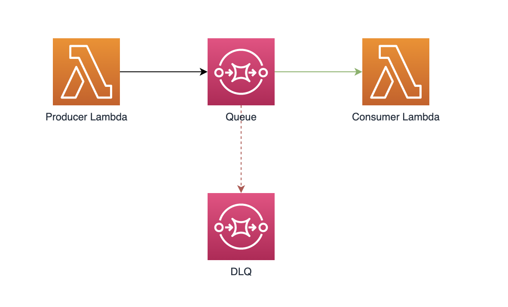
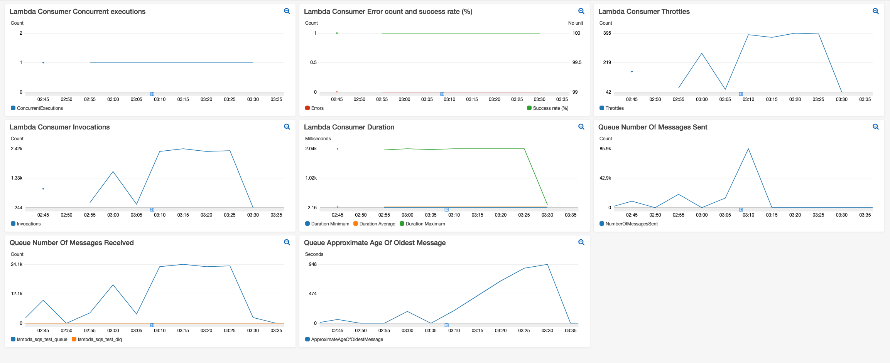

# lambda-sqs-test
Testing sqs to lamba throttling behavior

## Requirements
* Python 3
* [Pipenv](https://pypi.org/project/pipenv/)
## Deploying the stack
* Clone the repository
* Setup the Python environment
``` shell
cd <the project directory>
pipenv install --dev
```

* Configure the bucket name of your target Amazon S3 distribution bucket and region where you'd like to deploy
``` shell
export SOLUTION_NAME=lambda-sqs-test
export DIST_OUTPUT_BUCKET=<S3 bucket to deploy the solution>
export VERSION=1.0.0
export AWS_REGION=us-east-2
```
_Note:_ You have to manually create an S3 bucket with the name "$DIST_OUTPUT_BUCKET"; 

* Next make the deploy script executable and run it
``` shell
cd ./deployment
chmod +x ./deploy.sh  \n
./deploy.sh
```
---
## Resources

The stack will create two lambda functions (producer/consumer) and two SQS queues (queue/dlq) along with necessary IAM policies and roles.




### Producer function
The producer lambda can be run from the console with a test payload. The function accepts a simple json payload with a single attribute of "count" to indicate how many messages to try and produce
```json
{
  "count": "100000"
}
```
When invoked the function will attempt to send as many messages with a random string payload as possible in batches of 10 before timing out.

### Consumer function
THe consumer function which is configured to run with a reserved concurrency of one does nothing but print the received message. It also will sleep for two seconds every 250 messages received per function instance.

### Dashboard
The stack also creates a dashboard to monitor the rate at which the consumer processes messages



Copyright 2019 Amazon.com, Inc. or its affiliates. All Rights Reserved.

Licensed under the Apache License Version 2.0 (the "License"). You may not use this file except in compliance with the License. A copy of the License is located at

    http://www.apache.org/licenses/

or in the "license" file accompanying this file. This file is distributed on an "AS IS" BASIS, WITHOUT WARRANTIES OR CONDITIONS OF ANY KIND, express or implied. See the License for the specific language governing permissions and limitations under the License.
